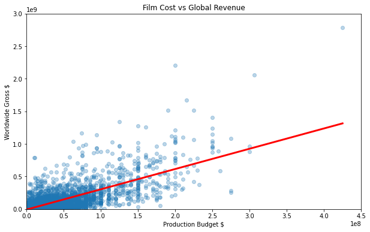

# Data Science and Machine Learning Bootcamp
## Contents
1. [ Overview ](#overview)
2. [ Software & Tools Used ](#tools)
3. [ Predict Movie Box Office Revenue with Linear Regression ](#section2)
4. [ Python Programming for Data Science and Machine Learning ](#section3)
5. [ Introduction to Optimisation and the Gradient Descent Algorithm ](#section4)
6. [ Predict House Prices with Multivariable Linear Regression ](#section5)
7. [ Pre-Process Text Data for a Naive Bayes Classifier to Filter Spam Emails: Part 1 ](#section6)
8. [ Train a Naive Bayes Classifier to Create a Spam Filter: Part 2 ](#section7)

## Overview
This repositry contains a number of Jupyter Notebook files developed as part of the Complete 2022 Data Science & Machine Learning Bootcamp found on Udemy. My motivation for this undertaking was to gain a strong foundational knowledge of Data Science and Machine Learning methods in my persuit of a career as a Data Scientist. This extensive course contained 40+ hours of video tutorials including coding challenges and project walkthroughs. Using Jupyter Notebook and a number of tools such as Matplotlib, Numpy and Tensorflow we completed a number of real world projects including image recognition, spam classification and property valuation. This has left me with a strong understanding of the methods used to visualise and analyse data using algorithmic logic and the confidence to apply this to further projects beyond this course.

## Software & Tools Used
- Anaconda
- Jupyter Notebook
- Python 3
- Tensorflow
- Pandas
- Numpy
- Scikit Learn
- Keras
- Matplotlib
- Seaborn
- SciPy
- SymPy

## Predict Movie Box Office Revenue with Linear Regression

Find the Jupyter Notebook here : [01 Linear Regression](01%20Linear%20Regression.ipynb)

- Learnt how to specify a data science problem
- Understood the importance of data cleansing and how to do so
- Incorporated Python modules into Jupyter Notebook
- Visualised and better understood data using Matplotlib
- Understood the theory behind linear regression and how it works
- Used Scikit Learn to estimate and interpret regression coefficients
- Developed a statistical model and used it to make a prediction
- Analised and evaluated regression results using metrics such as R-squared

|  |
|:--:|
| *Figure 1: linear regression model showing movie production budget versus gross revenue* |

## Python Programming for Data Science and Machine Learning

Find the Jupyter Notebook here : [02 Python Intro](02%20Python%20Intro.ipynb)

- Understood how to use variables and types to manage data
- Worked with Python collections: Lists, Numpy Arrays, Pandas DataFrames, Series
- Used Python modules and import Python packages
- Used Python functions to simplify complex operations
- Understood function arguments, parameters and return values
- Worked with Python objects
- Learnt how to use Python documentation to solve further problems

## Introduction to Optimisation and the Gradient Descent Algorithm

Find the Jupyter Notebook here : [03 Gradient Descent](03%20Gradient%20Descent.ipynb)

- Understood how optimisation works in practice and how parameters in a machine learning model are estimated
- Understood the role of cost functions
- Worked with calculus in Python: derivatives and partial derivatives
- Worked with Python tuples
- Used looping to run the Gradient Descent optimisation algorithm
- Understood the effect of the learning rate, multiple minima and the pitfalls with optimisation algorithms
- Learnt to manipulate, reshape, concatenate and transpose data in N-Dimensional arrays
- Created 3-dimensional plots and charts
- Understood the Mean Squared Error cost function
- Worked with nested looping in Python

## Predict House Prices with Multivariable Linear Regression

Find the Jupyter Notebooks here : [04 Multivariable Regression](04%20Multivariable%20Regression.ipynb)
                                  [05 Valuation Tool](05%20Valuation%20Tool.ipynb)

- Explored a dataset by examining summary statistics, finding missing values and discovering outliers
- Created powerful visualisations using Matplotlib and Seaborn to examine how data is distributed and see relationships present in the data
- Worked with index and dummmy variables in datasets
- Understood how to interpret and measure correlations in the data
- Learnt how to diagnose and address probles like Multicollinearity in Linear regression
- Learnt how to transform data to improve a model
- Evaluated models performance an learnt how to decide on a regression model using the Baysian Information Criterion
- Understood control flow and logical operators in Python
- Understood docstrings and optional arguments in Python

## Pre-Process Text Data for a Naive Bayes Classifier to Filter Spam Emails: Part 1

Find the Jupyter Notebook here : [06 Bayes Classifier - Pre-Processing](06%20Bayes%20Classifier%20-%20Pre-Processing.ipynb)

- Understood the intuition behind the Naive Bayes Classification Algorithm
- Understood basic, joint and conditional probability as well as Bayes Theorem
- Understood the role of Paths and how to access external resources from a Jupyter Notebook
- Used generator functions in Python to work with large datasets
- Cleaned a dirty dataset and learnt how to process text data
- Visualised data using Pie and Donut charts as well as Word Clouds
- Introduced to natural language processing in order to convert, stem and tokenise text data
- Learnt how to install third party packages and dependencies
- Learnt how to check for membership in a Python Collection

## Train a Naive Bayes Classifier to Create a Spam Filter: Part 2

Find the Jupyter Notebook here : [07 Bayes Classifier - Training](07%20Bayes%20Classifier%20-%20Pre-Processing.ipynb)

- Learnt how to save and load files external to a Jupyter Notebook
- Calculated the 'spammyness' rating of individual words in emails
- Built a spam classifier from sratch using probability theory and Laplace smoothing techniques
